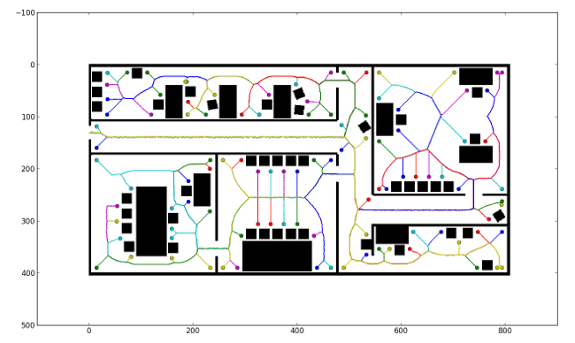

Robot Navigation
================

A 2-dimensional robot navigation library.  The library takes a binary occupancy
map and the robot's current position as input, and outputs movement vectors.
The goal is to explore a maze of indoor hallways filled with obstacles.  The
library iteratively updates its internal representation of the world as the
robot discovers new areas.

Algorithm
---------

At a regular interval, accept the current representation of the world and the
robot's current position.

1. Generate a [medial axis](https://en.wikipedia.org/wiki/Medial_axis) of the
   area.

2. Find the endpoints of the medial axis, along with the paths to those
   endpoints.  Assume a path that disappears into an unknown region has an
   endpoint right at the transition

3. Iterate the below steps until all endpoints are explored.

  1. Generate all paths to visible unvisited endpoints.

  2. Choose the nearest unvisited endpoint (via shortest path) and follow the
     path leading to it.

  3. Once the endpoint is reached, mark it as visited.

Example
-------

